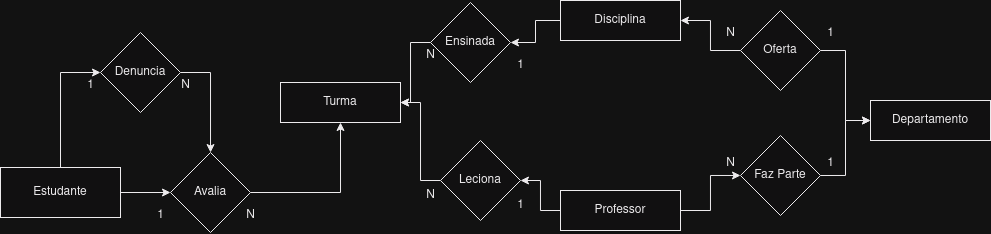
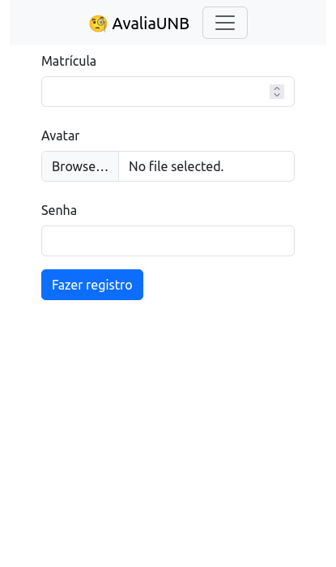

# AvaliaUNB

O objetivo desse projeto é exercitar o conteúdo da matéria de Bancos de Dados da UNB. Isso foi feito através da criação de um sistema de avaliação de professores, utilizando Flask e PostgreSQL, sem a utilização de ORMs.

# Como rodar o projeto

Instalação de dependências de sistema:
- Instalar [docker](https://docs.docker.com/get-docker/)
- Instalar [python](https://www.python.org/downloads/)

Inicializar e popular banco de dados:
- Usando o comando do docker compose: `docker compose up`
- Antes de iniciar a aplicação executar o arquivo `seed.py`
  - Como executar a partir da raíz do projeto: `python3 ./src/seed.py`
  - O script executa os dois arquivos de banco de dados localizados em `src/sql`
Com tudo instalado podemos rodar o projeto:
- Rodar comando `pip install -r requirements.txt` para instalar as dependências
- Rodar o projeto com o comando `flask --app src run --debug`

# Resultados

Os resultados obtidos na execução do projeto podem ser encontrados no relatório em `./docs/Relatório Projeto Prático Bancos de Dados.pdf`, mas para facilitar vou resumir aqui.

## Modelo Entidade Relacionamento (MER)

O Modelo Entidade-Relacionamento é uma técnica de modelagem conceitual que representa os dados em bancos de dados através de entidades (objetos do mundo real) e seus atributos. As entidades são conectadas por meio de relacionamentos, mostrando as associações entre elas. Esse modelo permite uma visão clara das entidades e seus relacionamentos antes da implementação física em um [SGBD](https://datasus.saude.gov.br/glossario/sistema-gerenciador-de-banco-de-dados-sgbd/).

## Modelo Relacional (ER)

O Modelo Relacional é um modelo de dados utilizado em bancos de dados relacionais, onde as informações são organizadas em tabelas bidimensionais (relações). Cada tabela possui colunas representando atributos e linhas contendo os valores dos registros. As relações são estabelecidas através de chaves primárias e chaves estrangeiras para representar as conexões entre as tabelas.

## Funcionalidades
- Autenticação
  - Cadastro
  - Login
- Administração
  - Aceitar ou Recusar denúncias
- Avaliação
  - Avaliar turmas
- Denúncia
  - Denunciar avaliações

## Fotos

  
  
  
  
  
  
  
  
  

